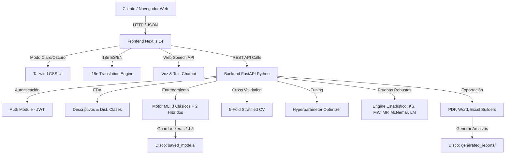
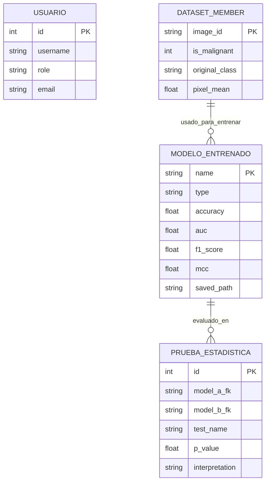
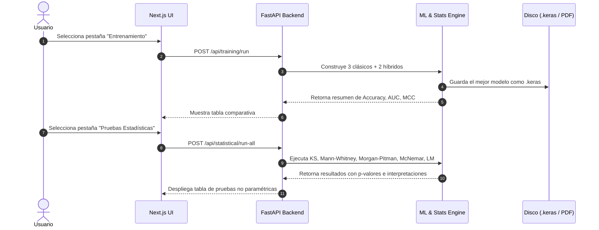
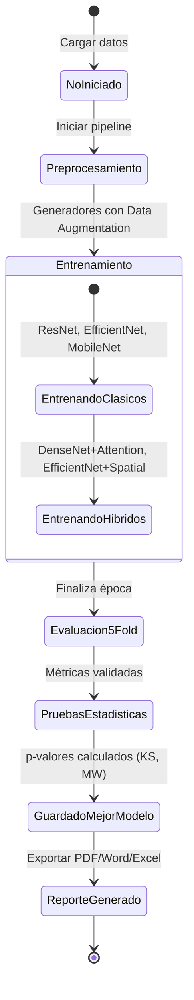

# 📐 Diagramas en Mermaid — Sistema DermAI Full-Stack Platform

Este documento reúne los 5 diagramas requeridos formateados formalmente en Mermaid.js para su renderizado directo en GitHub o editores Markdown.

---

## 1. Diagrama de Arquitectura de Software



---

## 2. Diagrama de Modelo de Datos



---

## 3. Diagrama de Componentes

```mermaid
componentDiagram
    package "Frontend Component Stack (Next.js)" {
        [Dashboard Page] --> [Navbar Component]
        [Dashboard Page] --> [Tabs Navigation]
        [Dashboard Page] --> [VoiceChatbot Component]
        [Navbar Component] --> [LanguageSelector]
        [Navbar Component] --> [ThemeToggle]
    }
    
    package "Backend Service Stack (FastAPI)" {
        [FastAPI Core] --> [Auth Router]
        [FastAPI Core] --> [EDA Router]
        [FastAPI Core] --> [Training Router]
        [FastAPI Core] --> [Stats Router]
        [FastAPI Core] --> [Reports Router]
        
        [Training Router] --> [Models Builder]
        [Stats Router] --> [Stats Engine]
        [Reports Router] --> [ReportLab / python-docx / openpyxl]
    }
```

---

## 4. Diagrama de Secuencia (Flujo de Entrenamiento y Pruebas Estadísticas)



---

## 5. Diagrama de Estados del Modelo de IA


